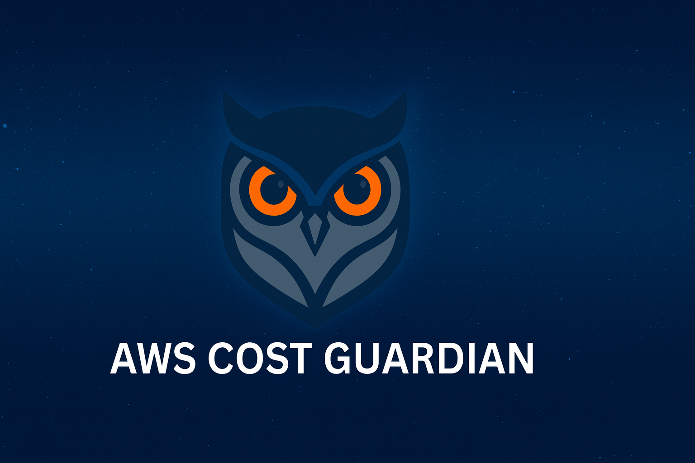

# Slack AWS Cost Guardian


> AI-powered AWS cost monitoring with Slack alerts

[](LICENSE)
[](https://www.python.org/downloads/)
[](https://aws.amazon.com/cdk/)

Detect spending anomalies, track budgets, and get intelligent analysis delivered directly to Slack.

## Features

- **Anomaly Detection** - AI-powered identification of unusual spending patterns
- **Daily & Weekly Reports** - Automated summaries with budget tracking and forecasts
- **Interactive Slack Alerts** - Acknowledge costs as expected/unexpected directly from Slack
- **Budget Threshold Alerts** - Warnings at 80% and critical alerts at 100% of budget
- **AI Analysis** - Claude or GPT explains what's driving cost changes
- **Learning Memory** - Learns from your feedback and conversations, remembers durable facts about your infrastructure (accepted baselines, known patterns), and applies them to every future check - so it stops re-flagging things you've already accepted. See [docs/MEMORY-SYSTEM.md](docs/MEMORY-SYSTEM.md).
- **Conversational Bot** - @mention or DM it (`@guardian what did we spend yesterday?`); it holds multi-turn context in a thread, consults learned memory, and can save facts on request (`@guardian remember that Cost Explorer costs are expected`).

## Quick Start

```bash
# Clone and setup
git clone https://github.com/your-org/slack-aws-cost-guardian.git
cd slack-aws-cost-guardian
make setup

# Configure (edit .env with your Slack webhooks and API keys)
vim .env

# Deploy
source .venv/bin/activate
make deploy

# Verify
make validate
```

**Full setup guide**: [docs/SETUP.md](docs/SETUP.md) - includes Slack App configuration, bot setup, and troubleshooting.

## How It Works

```
┌─────────────────┐     ┌─────────────────┐     ┌─────────────────┐
│   EventBridge   │────▶│     Lambda      │────▶│  Cost Explorer  │
│   (scheduled)   │     │   (collector)   │     │      API        │
└─────────────────┘     └────────┬────────┘     └─────────────────┘
                                 │
                                 ▼
                        ┌─────────────────┐
                        │    DynamoDB     │
                        │   (snapshots)   │
                        └────────┬────────┘
                                 │
                    ┌────────────┴────────────┐
                    ▼                         ▼
           ┌─────────────────┐       ┌─────────────────┐
           │ Anomaly Detect  │       │   LLM Analysis  │
           └────────┬────────┘       └────────┬────────┘
                    │                         │
                    └────────────┬────────────┘
                                 ▼
                        ┌─────────────────┐
                        │  Slack Alert    │◀───── User Feedback
                        │  (with buttons) │
                        └─────────────────┘

┌─────────────────┐     ┌─────────────────┐
│  Slack @mention │────▶│  Events Lambda  │────▶ Bot Response
│    or DM        │     │  (with tools)   │
└─────────────────┘     └─────────────────┘
```

### Learning loop

Feedback and conversation feed a **curator** that maintains two layers of memory,
which are then applied back to every assessment:

```
alert feedback ──┐
"remember this" ─┼─▶ Curator (LLM) ─▶ Hot memory (DynamoDB, every check)
                 │                   └▶ Deep memory (OKF concepts in S3)
                 └─ triggers event-driven (watermark-gated; weekly backstop)

Hot memory ─────▶ injected into every anomaly analysis
Deep memory ────▶ read by the bot when answering questions
```

You click "expected" on an alert, or tell the bot to remember something in plain
English, and the guardian folds it into memory and stops flagging it. Full design:
[docs/MEMORY-SYSTEM.md](docs/MEMORY-SYSTEM.md).

## Cost to Run

This tool costs approximately **$2-8/month** depending on your settings:

| Component | Cost | Notes |
|-----------|------|-------|
| Cost Explorer API | ~$1.50-6/month | Depends on collection frequency |
| Secrets Manager | ~$0.40/month | Per secret |
| DynamoDB | ~$0.05/month | On-demand, minimal storage |
| Lambda/S3 | ~$0/month | Free tier covers it |
| LLM API (optional) | ~$0.30-1.00/month | For AI insights |

See `config/config.example.yaml` for detailed cost breakdown and optimization tips.

## Configuration

### Application Settings

Copy and customize the config file:

```bash
cp config/config.example.yaml config/config.yaml
```

Key settings:
- **Collection frequency** - How often to fetch costs (daily recommended)
- **Budget thresholds** - When to alert (80%, 100%)
- **Anomaly sensitivity** - What triggers an alert ($10 change, 50% increase)

### AI Context

Customize the AI's understanding of your infrastructure:

```bash
vim config/guardian-context.md
make update-context
```

## Documentation

- **[Setup Guide](docs/SETUP.md)** - Complete installation and configuration
- **[Architecture](docs/ARCHITECTURE.md)** - Technical reference and data models
- **[Memory System](docs/MEMORY-SYSTEM.md)** - How learning memory works (design + internals)
- **[Backlog](docs/BACKLOG.md)** - Roadmap and planned features

## Common Commands

```bash
make help              # Show all commands
make deploy            # Deploy to AWS
make validate          # Verify configuration
make test-daily        # Send daily report
make logs              # Tail collector logs
make logs-events       # Tail bot logs

# Learning memory
make show-memory       # Show current hot memory
make list-memory       # List deep-memory concepts + index
make set-memory TEXT="..."   # Seed a hot-memory fact
make clear-memory      # Clear hot memory
make test-curate       # Dry-run the curator (no writes)
make run-curator       # Run the curator now
```

## License

MIT License - see [LICENSE](LICENSE) for details.